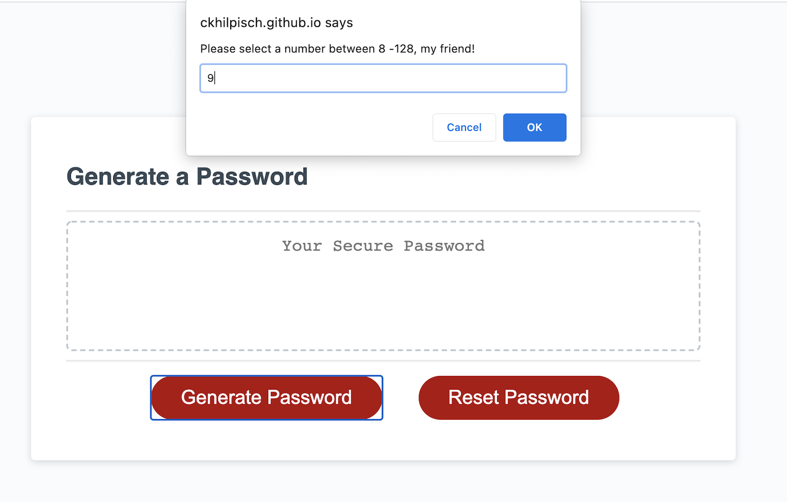
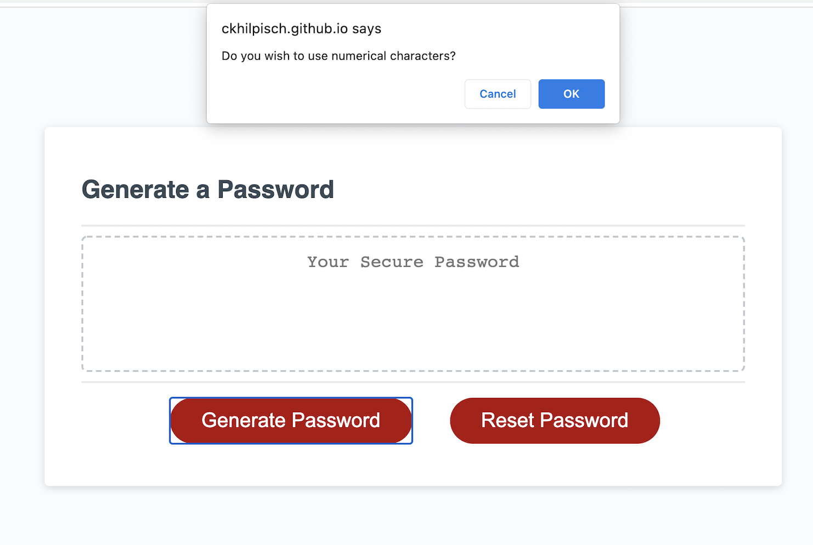
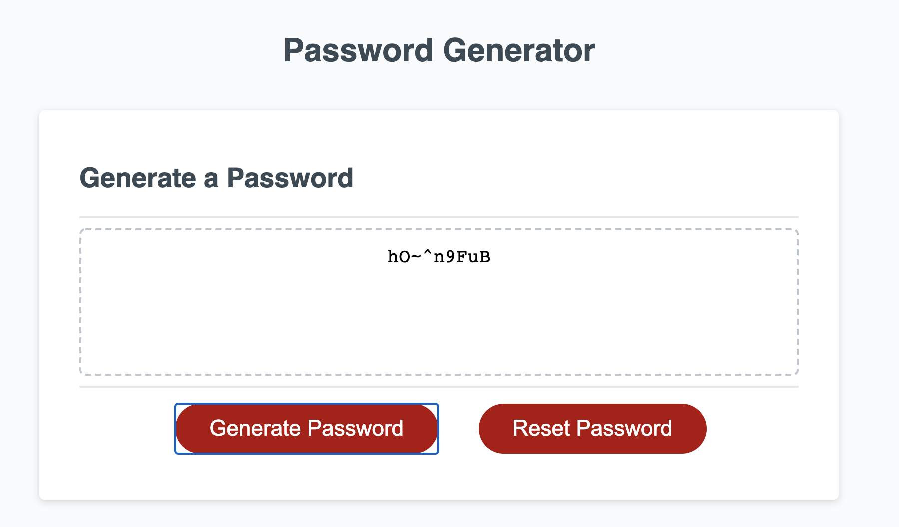

 
# 
 Password Creator

## 
Table of Contents:

* [Description](#description)
* [Technologies](#technologies)
* [Usage](#usage)
* [Visuals](#visuals)
* [Contributing](#contributing)
* [Questions](#questions)
* [License](#license)

## 
 <a name="description"> **Description** :
 

Tasked with making a password creator that would, based upon user input, create a password of a specified length with specific characters of the users choice 

## 
 <a name="technologies"> **Technologies** :
 

### CSS
### Bootstrap
### Javascript
### HTML

## 
<a name="usage"> **Usage** :</a>

This user goes to the website and is prompted with questions about the length of the password and what characters the user would like to use (numerical, letters, and special characters).  Based upon the user's answers, a user specific password is created.  

### 
 The Webpage : 

 https://ckhilpisch.github.io/Password_Creator/

 
 

## 
<a name="visuals"> **Visuals** :</a>

 

## 
<a name="contributing"> **Contributing** :</a>

Pull requests are always welcome.  When contributing to this repository, please first discuss the change you wish to make via email or issue.  
After approval, please follow the "fork-and-pull" Git workflow.
<ol>
<li>Fork the repo on GitHub</li>
<li>Clone the project to your own machine</li>
<li>Commit changes to your own branch</li>
<li>Push your work back up to your fork</li>
<li>Submit a Pull request so that we can review your changes</li>
</ol>

## 
<a name="questions"> **Questions** :</a>

If you have any questions, feel free to reach out to me.   My email is ckhilpisch@gmail.com.

## 
 <a name="license"> **License** : 
 

MIT License
Informataion avaiable here: 
https://opensource.org/licenses/MIT

